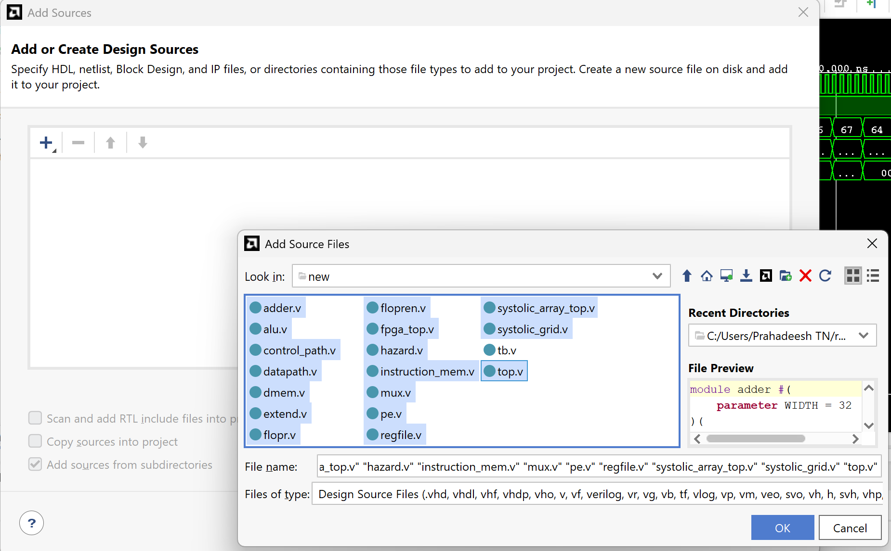
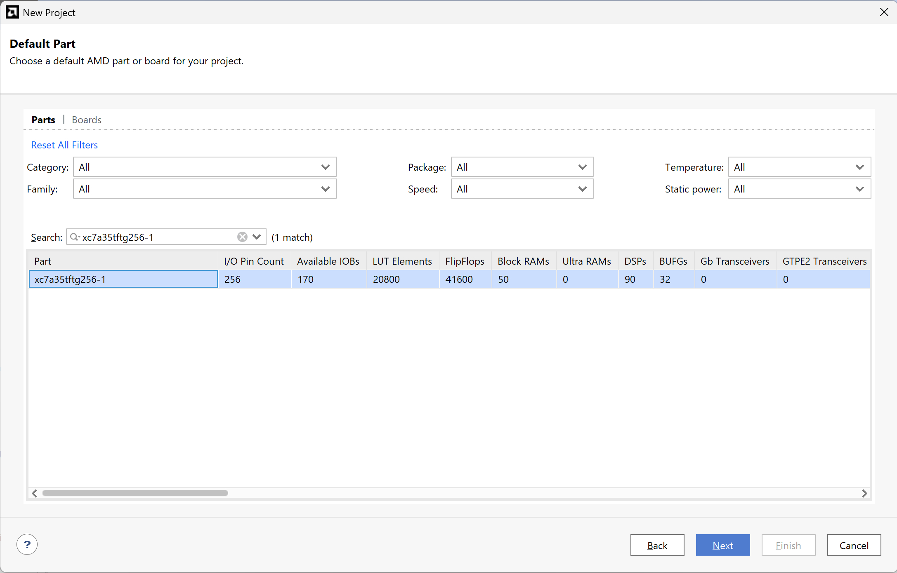
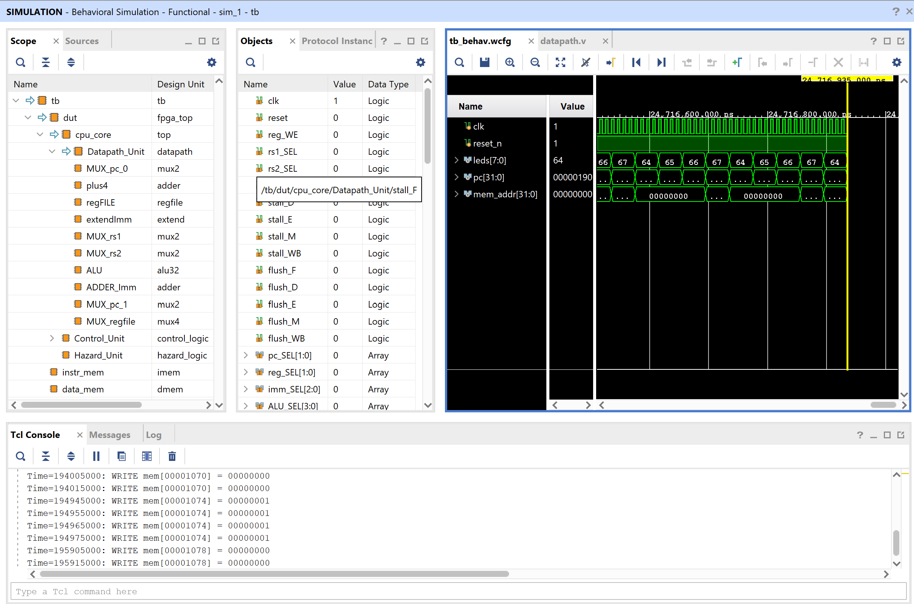
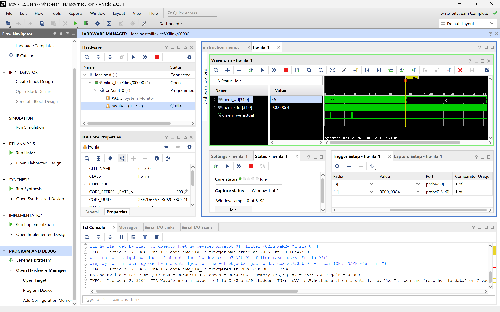

# RISC-V Processor with Systolic Array Accelerator

A custom 5-stage pipelined **RISC-V (RV32I)** processor integrated with a **4×4 systolic array** matrix multiplication accelerator. The CPU handles control flow and scalar math; the systolic array computes 4×4 matrix multiplication in parallel hardware via memory-mapped I/O — achieving **~145× speedup** over software execution.

Implemented in Verilog, verified via simulation, and hardware-tested on the **Anmaya FPGA Board** (`xc7a35tftg256-1`).

**Author:** Prahadeesh Narendran Thimma, with the help of AI

---

## Prerequisites

| Tool | Version |
|---|---|
| [Xilinx Vivado](https://www.xilinx.com/products/design-tools/vivado.html) | 2020.2 or later |
| FPGA Board | Anmaya Board (`xc7a35tftg256-1`) — only needed for hardware testing |

*(Note: Python is included in the repo but is completely optional. You can just use the pre-compiled instruction file!)*

---

## Repository Structure

```
riscV/
├── instructions/
│   ├── generate_imem.py         # Python assembler (optional)
│   └── imem.dat                 # Pre-generated instruction memory (hex)
└── srcs/
    ├── constrainsts_artix7/
    │   └── pin_constraints.xdc  # Pin mappings for the Anmaya Board + ILA config
    ├── rtl_files/
    │   ├── rtl/                 # All processor and systolic array .v source files
    │   └── tb/                  # Simulation testbench (tb.v)
    └── source/
        └── imem.dat             # Copied instruction memory for Vivado simulation
```

---

## Step 1: Instruction Memory

You do **not** need to run any Python scripts or compile any code. A pre-generated `imem.dat` file containing the compiled matrix multiplication assembly program is already included in the repository! 

Just proceed directly to Step 2 to set up Vivado.

> *(Optional: If you ever want to write your own custom assembly code, you can edit and run `riscV/instructions/generate_imem.py` to generate a fresh `imem.dat`, but it is absolutely not required to get the project working).*

---

## Step 2: Create a Vivado Project

1. Open Vivado → **Create Project** → name it anything → **RTL Project** → **Next**.

2. **Add Design Sources:**
   - Click **Add Files**, navigate to `riscV/srcs/rtl_files/rtl/`, and select **all `.v` files**.
   - Check ✅ **"Copy sources into project"** → **Next**.

   

3. **Add Simulation Sources:**
   - Click **Add Files**, navigate to `riscV/srcs/rtl_files/tb/`, and select **`tb.v`**.
   - Check ✅ **"Copy sources into project"** → **Next**.

4. **Add Constraints:**
   - Click **Add Files**, navigate to `riscV/srcs/constrainsts_artix7/`, and select **`pin_constraints.xdc`**.
   - Check ✅ **"Copy constraints into project"** → **Next**.

5. **Select Part:**
   - Search for **`xc7a35tftg256-1`** → select it → **Next** → **Finish**.

   

6. **Fix the `imem.dat` path:**
   Open `instruction_mem.v` in the Vivado editor and update the path to point to your `source/imem.dat` file:

   ```verilog
   parameter INITIAL_DATA_PATH = "C:/your/absolute/path/to/riscV/srcs/source/imem.dat";
   ```
   > ⚠️ Use **forward slashes** (`/`) even on Windows. Relative paths break in simulation because XSim runs from a nested directory.

---

## Step 3: Run the Simulation

1. In the **Flow Navigator** (left panel), click **Run Simulation → Run Behavioral Simulation**.

2. The testbench prints every memory write to the **Tcl Console** automatically:
   ```
   Time=1234: WRITE mem[0000007c] = 00000001
   Time=5678: WRITE mem[000000c0] = 00000040
   Time=9012: WRITE mem[000000c4] = 00000024
   ```

   


3. **What to verify:**

   | Address | Expected Value | Meaning |
   |---|---|---|
   | `0x00`–`0x7C` | Matrix elements | Matrix A & B initialization |
   | `0xC0` | `0x40` (64) | Software multiplication loop count |
   | `0xC4` | `0x24` (36) | Hardware systolic array cycle count |

---

## Step 4: FPGA Hardware Testing (Anmaya Board)

The `fpga_top.v` file already has the necessary signals marked for debugging using the `(* mark_debug = "true" *)` attribute. 

You have two options to set up the Integrated Logic Analyzer (ILA):

### Option A: Use the Vivado Debug Wizard
If you want to configure the ILA yourself:
1. Open `pin_constraints.xdc` and delete all the lines at the bottom starting with `create_debug_core`.
2. Run **Synthesis** from the Flow Navigator.
3. Once Synthesis completes, click **Set Up Debug** in the Flow Navigator.
4. The wizard will automatically detect the 3 marked signals. Set the **Sample Depth** to `8192` and click **Finish** to automatically generate the debug cores.
5. Save constraints and proceed to Implementation.

### Option B: Use the Pre-configured Constraints
The `pin_constraints.xdc` file already contains the fully configured ILA core definitions at the bottom. If you don't delete them, you can completely skip the Debug Wizard! Just click **Run Synthesis** and then directly click **Run Implementation**.

---

### Program and Trigger

1. Turn on your Anmaya Board and connect it via USB.
2. Open **Hardware Manager** → **Open Target** → **Auto Connect**.

> ⚠️ **CRITICAL: JTAG Clock Speed**
> If you get connection errors or the ILA fails to arm, you must lower the JTAG hardware server frequency. The data speed of the port must be lower than the operating clock speed. Right-click your hardware target (e.g., `localhost/xilinx_tcf/...`), select **Hardware Target Properties**, and change the **JTAG Clock Frequency to 125000 Hz**.

3. **Program Device** → select the generated `.bit` file.
4. The **ILA dashboard** opens automatically. In **Trigger Setup**:
   - `dmem_we_actual == 1` (Binary)
   - `mem_addr == 000000C4` (Hex)
5. Click **Run Trigger** (▶T), then **toggle the reset slide switch** on the board.
6. The waveform captures the exact cycle the CPU writes the hardware result. Read the value from `mem_wd` to see the cycle count!

  


---

## Memory Map

| Address | Region |
|---|---|
| `0x0000 – 0x0FFF` | Data Memory (CPU) |
| `0x1000 – 0x103F` | Systolic Array — Matrix A buffer |
| `0x1040 – 0x107F` | Systolic Array — Matrix B buffer |
| `0x1080 – 0x10BF` | Systolic Array — Result C (read-only) |
| `0x10C0` | Systolic Array — Control (write `1` to start) |
| `0x10C4` | Systolic Array — Status (bit 0 = done) |
